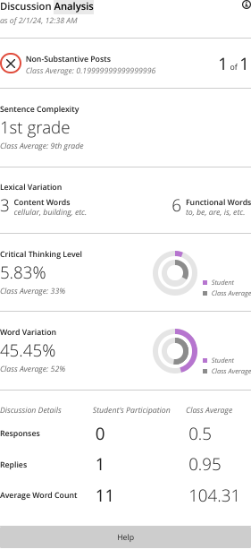
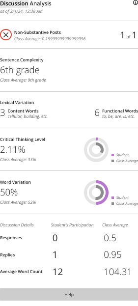
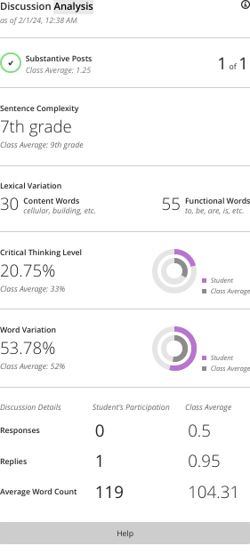
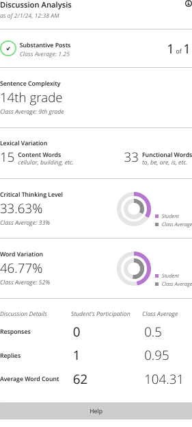

# Reading / Journal 7

## Meaning and Files ✏️

Journals are a combination of a few things. First, the "journal." This is a very small weekly assignment where you write 200+ words (option 1) or submit  "tinker" code (option 2). Second, the "reading." This is where I direct you to read from a book, an online article, or watch a video, and I supplement those with my own lecture notes, graphs, figures, quotes, or so on.

All other assignments and lectures build upon these. Usually, there will be more reading at the start of a unit and less at the end.

## Reading

So far in this course we've recapped CIT 120 topics from a solid Python perspective.

Today, we go further than CIT 120.

You'll be reading about manipulating files today, which is good knowledge to have. You can use this skill to, for example, process text from all the books written by all the Bronte sisters, load stats data you've downloaded, etc.

**Now read Chapter 10** from our textbook.

But as you saw in Lab 1, just blindly parsing data from a file like this is...not that meaningful. So you have some files and you have some results. So what? What can you tell me about the real world based on those results?

I have two readings I like to assign to help folks think through what data means, regardless of what major they want to go into (math, programming, literature, ethics, etc.).

The first is an excerpt from *Quantitative Ethnography*, or QE for short. In ethnography, we want to understand culture, and we want to have that understanding grounded in real, empirical data. The "quant" in quantitative ethnography is about understanding the underlying mathematical relationships in the claims we have about our empirical data. Put another way, in research our goal is often to tell a rich qualitative story whose turns are guided by quantitative features.

**Now read the following parts of QE Chapter 1** from <https://www.quantitativeethnography.org/images/pdf/QuantitativeEthnography_SampleChapter.pdf>:

- Page 7 and the first half of page 8 (that's pages 16 and 17 of the PDF)
- The "Mining Shrimp" section
- The "Understanding People" section
- And you're free to read more, but those are the only sections we need for today's topic

(Update for Fall 2021: I just had a QE paper accepted for publication. If you're interested, it's linked on my homepage, <http://mariahknowles.com/>, under "Telling Stories of Transitions." Note, I did my analysis using Julia, not Python.)

The second is about writing and using standardized tests. Standardized tests are meant to *measure* something. Tests are an attempt to understand and quantify something we care about in real life, and those things are often very hard to quantify. For example, creativity. If I administer a test to you and you get a 50/300, what does that actually *mean*? What does that score actually tell me about you? What decisions can I make based on that result? If you're the only person I'd be giving the test to, wouldn't I be better off just interviewing and getting to know you myself? In other words, just like in the QE book, we have data, and we need to make proper sense of it.

**Now read Table C from the "Code of Fair Testing Practices"** from <https://www.asha.org/policy/rp2004-00195/>

As you think about what your data might mean, remember, as I see it, there are four parts to this picture:

- What you are looking AT: There's something in real life that you want to know about. But, you can't know about *everything*, so you have to choose something to look AT: some subreddit to scrape, some population to interview, etc. You should be able to give me an overall description of your "AT" to set the context. If you say that something is interesting or stands out, I gotta know the "norm" that it is standing out from. And that comes from your "AT".
- What you are looking FOR: Not every single detail of what you might observe or measure or so on in your AT will help you answer your research question. And if you are using data that someone else collected, know that their research question was different, so what they included in their data might not be *exactly* what you want. Either way, there is something about your real life picture that you care to know more about, so you look FOR details/measurements/descriptions/etc. about that thing. And if you don't look FOR it, you can't conclude about it.
- The REAL LIFE view of the data: The real life component is why we care about your interest in the first place. This is open-ended. This is defeasible. This is the *actual* data. I *could* disagree with you about these points, about what this data might mean, and yet you convince me otherwise.
- The REPRESENTATION view of the data: How we record information, and what Python can look at and understand, is limited. When we represent someone's address as a GPS coordinate, we are making a decision as a researcher. We lose all the data about how big their yard is, what games their kids like to play, which one of their family friends helped them paint when they first moved in, where are the best spots to hide easter eggs for the kids of the neighborhood to find, etc. Those memories might be *important* to the folks living there. But maybe ignoring that is fine (rude, but fine) for the research question we have. Unlike the REAL LIFE view, I'm not going to disagree with you about where on Earth a particular GPS coordinate is. But, I might disagree with you that what your REPRESENTATION ignored was actually important after all.

Notice I mention "ignoring" a lot. My test, personally, for whether it's okay to ignore something is this: If I ignored X, would my answer to my question be inadequate?

---

Update for Spring 2024:

As I've been teaching, Blackboard has gone through several upgrades from year to year. The biggest was when we moved from Blackboard to Blackboard Ultra.

One of the features Ultra introduced was Sentence Complexity. Here's a few real examples from the Spring 2024 semester.

A first grade example:

A sixth grade example:

A seventh grade example:

A fourteenth grade example:

Here, Blackboard is automatically showing teachers a measure of how advanced students' writing is in their discussion board posts. [You should read Blackboard's documentation about this feature](https://help.blackboard.com/Learn/Instructor/Ultra/Interact/Discussions/View_Discussion_Performance#Complexity).

A problem with this system, in my classes at least, is it doesn't tell me anything about the *quality of the student's contribution*, the *measure of their effort*, or *their progress towards some learning objective*.

What happens when students who upload a video with an amazing discussion in it? Unless they also write a lot in that post, because the system does not look at the video itself, they are rated as having a 1st grade writing level, since there just wasn't enough writing.

In this way, the automation favors students who prefer to express themselves in writing -- but not any of the other media types, like audio, video, visual, or even source code.

This week I'm having you think about how you interpret your data. It is also worthwhile to be aware of the information systems that *others* see you through, and to think about how that affects the way they interpret *you*.

From the grade levels assigned above, what can you tell me much about the *goodness* of what the students are doing?

## Journal

Choose from one of the following two options as you best see fit:

**Option One:** Submit a brief "200+ Words" reflecting on the reading and/or the course as a whole. These 200+ words are expected to come completely from the student, ignoring words from quotes/etc. The format of these assignments is up to the student as it best helps them: bulleted point notes on the reading; questions directed at the instructor of course material; a paragraph reflecting on the Lab assignment for the week; a poem; a summary of recent technology news; anything, so long as it is turned in on time, is relevant to the course, and meets the required length. 

**Option Two:** Submit a brief "Tinker" where you have attempted to "program" something, using the tools of the course, that is not directly related to another course assignment. Include screenshots of the input work done and the output result (even if it does not work), along with a brief statement of your intentions, the approach you took in getting it to work, and your thoughts on your result so far. Make sure it is clear what code came from you and what came from online/the reading/etc.

!!! note "Short on Words?"
    
    Short a few words in your journal and don't know what else to write about?

    This week's "get to know you" question is:

    *Share a kitchen tip or hack that has changed the way you cook or prep food.* [(Credit)](https://jonitrythall.com/daily-discussion-prompts-wiggle-work-way)

    Feel free to write about this a little bit in your journal.

## Submission

Submit your journal as a Word/PDF (NOT a .pages) document to Blackboard.

## Grading

Journals are each worth 1/100 towards your final grade. Grading is pass/fail based on meeting the requirements of the chosen option.